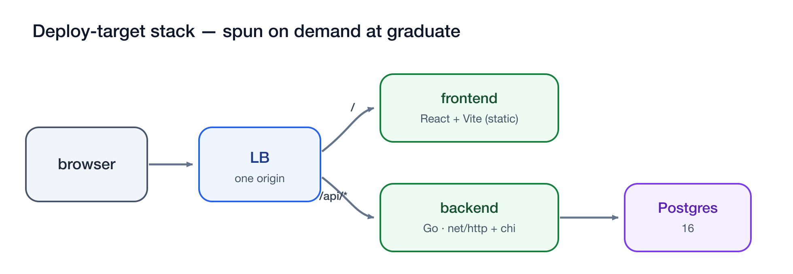

# Sandforge

**The fastest, fully-local inner loop of the AI SDLC** — a one-command local Git forge where
multiple AI agents iterate code → review → fix → check against *real* GitHub-Actions CI, then emit
one clean, validated PR to upstream.

<p align="center">
  
</p>

## Choose your path

Sandforge serves two different readers. Pick the one that fits — neither is the default.

| | **A · Use Sandforge** | **B · Build / contribute** |
|---|---|---|
| **You are** | running it to develop *your* project | hacking on Sandforge itself |
| **You need** | just the `sandforge` binary — **no repo checkout** | this repo + the Go toolchain |
| **Start here** | 📖 **[User Guide](docs/userguide.md)** | [Build from source](#b--build-from-source) ↓ |

Everything below the User Guide is for users; everything under *Build from source* is for
contributors. Reference docs sit between: [goal](docs/goal.md) (the contract),
[design](docs/design.md) (architecture), [prd](docs/prd.md) (first deploy target),
[premortem](docs/premortem.md) (failure modes + guards).

## A · Use Sandforge (one self-contained binary — no repo needed)

```bash
# No Go toolchain needed — the installer tries a pre-built release, then local Go,
# then builds inside a golang Docker container (Docker is required by sandforge anyway):
curl -fsSL https://raw.githubusercontent.com/jpoley/sandforge/main/scripts/install.sh | bash

# …or, with Go 1.25.4+ installed:
go install github.com/jpoley/sandforge/cmd/sandforge@latest

sandforge e2e                                # stand it up + run the WHOLE closed loop, validating every AC
```

Pre-built binaries (linux/darwin, amd64/arm64) are published for tagged versions on the
[Releases page](https://github.com/jpoley/sandforge/releases); `go install @latest` resolves to
the newest commit on `main`.

**Using Claude Code?** The installer also drops a **`/sandforge-setup` skill** into
`~/.claude/skills` (when it detects Claude Code — `~/.claude` or the `claude` CLI; skip with
`SANDFORGE_NO_SKILL=1`) — ask Claude to "set up sandforge" and it will preflight your machine (Docker
running? port free?), install the binary, bring the forge up in the background, and wire `@claude`
PR reviews to the Claude Code CLI **on your subscription** (no API key). The skill source lives at
[`.claude/skills/sandforge-setup/SKILL.md`](.claude/skills/sandforge-setup/SKILL.md).

All deploy assets are embedded; the binary materializes them at runtime, so **end users never clone
this repo**. The [User Guide](docs/userguide.md) walks through install → wiring any repo → connecting
every top coding agent → graduating one clean PR.

`sandforge e2e` (idempotent, repeatable) builds the CLI + warm CI image, brings up the control
plane, seeds a local upstream, runs **3 concurrent AI-agent simulations** against real CI, promotes
`work/* → staging → main`, spins the deploy-target stack, runs **machine-checked PRD validation**
(10 success criteria incl. Playwright UI e2e), opens **one squash PR** upstream, and prints a
per-criterion pass/fail report. Exit 0 only if every checked criterion passes.

## B · Build from source

Only contributors need this. Building uses **mage** (the Makefile is gone):

```bash
git clone https://github.com/jpoley/sandforge.git && cd sandforge
mage build      # compile bin/sandforge (regenerates embedded assets)
mage e2e        # build + run the full closed loop
mage -l         # list all targets
```

Diagrams in `docs/` are generated from hand-authored SVG sources in `docs/diagrams/` — run
`scripts/render-diagrams.sh` (needs `rsvg-convert`) after editing an `.svg` to regenerate its PNG.

### Latest validated run

Verified green on macOS / Apple Silicon / Docker Desktop 29 — including from the **standalone
binary run outside the repo**:

```
 ✅ AC-1  Inner loop ≤30s            fastest agent loop 25.0s; warm loop 11.5s
 ✅ AC-2  Warm runner overhead       no cold-runner penalty
 ✅ AC-3  Review handoff             review comment in 0.3s
 ✅ AC-4  3 concurrent agents        3/3 green on isolated worktrees, no collision
 ✅ AC-5  No creds leak              runner env clean of GITHUB/GH/AWS/GITLAB/NPM tokens
 ✅ AC-6  One clean squash PR        opened on upstream with PRD report
 ✅ AC-7  PRD machine-checked        10/10 SC pass; staging-main gates green
 ✅ AC-8  e2e vs running env         deploy-target spun on demand + torn down
 ✅ AC-9  Footprint                  control plane ≈284 MiB (≤2 GB)
 RESULT: ALL CHECKED CRITERIA PASSED ✅
```

## Day-to-day commands

```bash
sandforge init                      # bring up control plane only (forge + Postgres + warm runner)
sandforge import <url> [name]       # seed a writable repo from upstream; keep upstream remote
sandforge status                    # one-screen instance summary
sandforge logs [svc] -f             # tail logs
sandforge graduate <repo> main      # rebase onto upstream, spin deploy-target, run e2e + PRD validation
sandforge upstream <repo> <branch>  # graduate then open the upstream PR (only prod-touching cmd)
sandforge down [--keep]             # tear down (optionally keep volumes)
sandforge reset                     # wipe instance state + rotate credentials
```

Agents never call the CLI — they just `git` against the fixed clone URL `http://127.0.0.1:3000`.

### Local "Copilot" — route Forgejo @mentions to coding agents

`sandforge agents` is an opt-in local emulation of GitHub Copilot: it subscribes to Forgejo
webhook events, routes `@mention` triggers (e.g. `@claude`, `@codex`) to configured coding agents,
and runs the **review** (comment back) or **handoff** (push a fix commit to the PR branch) — all on
your machine. State persists to files under `~/.sandforge/<project>/agents/` (`config.json` +
`events.jsonl`), and a small web UI views the timeline and creates/edits agents.

```bash
sandforge agents start [--port 3999] [--repo owner/name]   # always-on background daemon (restarted by init)
sandforge agents status                                    # is it running? where?
sandforge agents stop                                      # stop + disable always-on
sandforge agents list                                      # show configured agents
sandforge agents add claude -- claude -p "review this PR"   # map a handle to a real agent CLI
sandforge agents trigger tasks 7 claude --pull -m "@claude review"   # manual handoff (no webhook)
sandforge agents serve [--port 3999] [--repo owner/name]   # same, but run in the FOREGROUND (Ctrl-C)
```

`agents start` runs the router as a **detached background daemon** that survives the terminal and is
brought back automatically by `sandforge init` (so it's always-on like Copilot); `agents up` runs it
**as a container** on the control-plane network instead; `agents serve` is the foreground form. Then
open `http://127.0.0.1:<port>` — a **React/shadcn web UI** to manage agents, fire manual handoffs,
and watch a live event timeline — and `@claude`/`@codex` on any PR or issue.

**Full guide: [docs/agents.md](docs/agents.md)** — run modes, wiring real agent CLIs (claude/codex),
the env contract, the security model, file persistence, and troubleshooting. The UI source lives in
`deploy/agents-ui/` (Vite + React + Tailwind v4); it builds to static assets embedded in the binary
(`mage webUI` to regenerate). The router fires the
agent in a clone of the repo at the PR head (env carries the repo/PR/comment + a local-only forge
token), posts the agent's output back as a comment, and pushes any commits it made. A hidden marker
on every agent comment prevents the bot from re-triggering itself. The agent command runs on the
host (where `git` + the agent CLIs live); the forge container reaches the listener via
`host.docker.internal` (override with `SANDFORGE_AGENTS_HOST` on Linux bridge setups). Seed agents
ship as safe `echo` stubs so the loop works out of the box — point `Command` at a real CLI to go
live. This is a separable feature layered on the core forge; it does not change the e2e contract.

## Architecture (two compose stacks — never conflated)

| Stack | Lifetime | Contents |
|-------|----------|----------|
| **Control plane** | warm | Caddy LB · Forgejo · Postgres · `act_runner` (host Docker, no DinD) |
| **Deploy target** | on-demand at `graduate` | Caddy LB · React/TS frontend + Go backend · Postgres |

The **control plane** is the diagram at the top of this README — agents push to Forgejo at
`127.0.0.1:3000`, a webhook fires `act_runner` on the host Docker daemon, and the single
`sandforge upstream` edge is the only path off your machine. The **deploy target** is the app under
test, spun on demand at `graduate`:

<p align="center">
  
</p>

## Layout

```
cmd/sandforge        # CLI entrypoint
assets.go            # embeds + materializes the deploy assets (standalone binary)
assets/deploy.tar.gz # generated embedded asset tarball (regenerated by `mage genAssets`)
magefiles/           # mage build targets (replaces the Makefile)
internal/{config,logx,compose,forge,prd,app}   # thin orchestration over docker/git/Forgejo API (loop.go lives in app)
deploy/control-plane # control-plane.compose.yml (pinned versions)
deploy/ci-image      # warm CI job image: Go+Node (arch-matched), fixes Docker 29 /var/run extraction
deploy/tasks-app     # the deploy-target reference app + verify.sh (SC runner)
docs/                # goal, design, prd, premortem, userguide
.logs/{decisions,events}  # JSONL decision + event logs
```

## Configuration

Embedded defaults are sensible; override via `sandforge.yaml` or `SANDFORGE_*` env (project name,
HTTP port, image versions, CI image, ephemeral mode). Most users never touch it.

## Requirements

**Inner loop** (`init`, `import`, agents pushing to warm CI): Docker (with Compose v2) and `git`.
The binary is self-contained for this path.
**Full `graduate` / `e2e`** additionally needs **Node + npm** on the host — the deploy-target's
frontend unit tests (SC-8) and Playwright UI checks (SC-6/SC-7) run on the host via `verify.sh`
(`npm ci` + `npx playwright`). Use `e2e --no-playwright` to skip the browser checks.
**Final PR to a real upstream:** `gh` (GitHub) — used only by `sandforge upstream`.
**To build from source:** Go 1.25+ and [mage](https://magefile.org). Tested on macOS / Apple
Silicon / Docker Desktop 29 and Docker 29 / Linux.

## Notes

- **Local upstream by default** for the self-test (repeatable/idempotent). Point `upstream` at real
  GitHub via `gh` to ship for real.
- **AC-1 "faster than GitHub incl. queue wait"** is a manual benchmark (can't be measured
  hermetically); the automated loop asserts the absolute ≤30s contract.
- **Docker 29 gotcha** (handled): standard `act` images symlink `/var/run → /run`, which Docker 29's
  hardened tar-extraction rejects, silently hanging every CI job. `deploy/ci-image` de-symlinks it.
