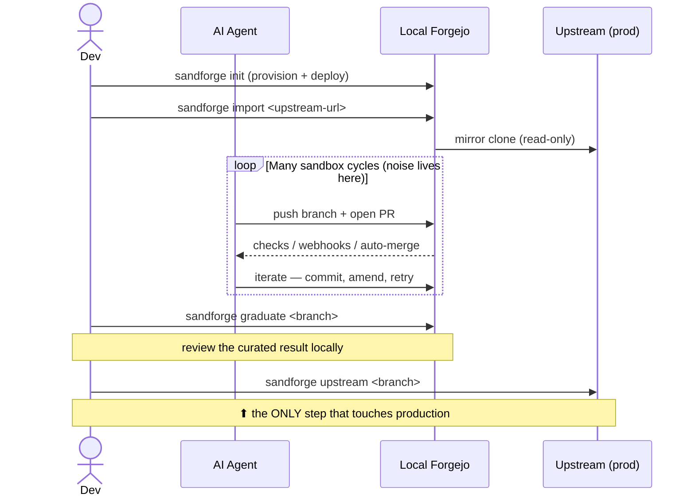
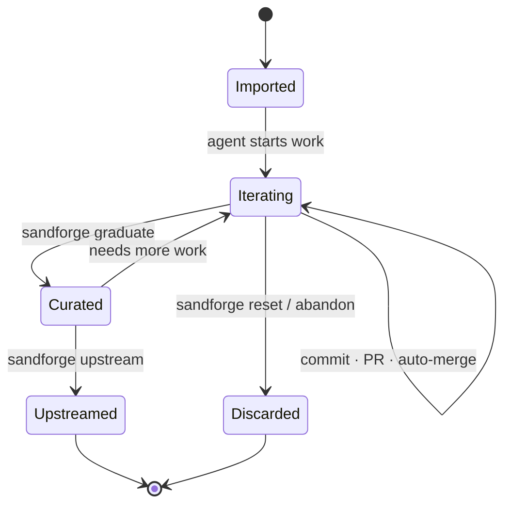
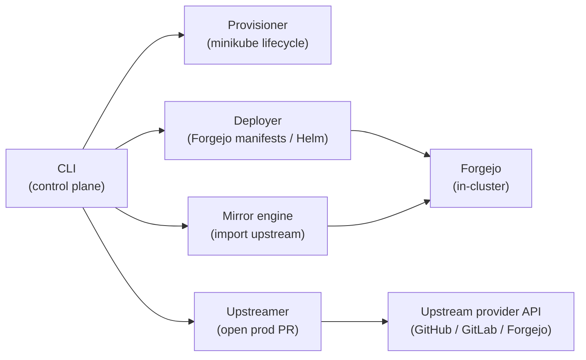

# Sandforge

> A local, Git-backed sandbox for iterating with AI agents — without polluting your team's production Git.
>
> *(name is a placeholder — rename freely)*

---

## 1. Motivation

Developers want to iterate aggressively with AI agents: dozens of branches, throwaway PRs, auto-merge experiments, broken commits, force-pushes, dead ends. That behaviour is *healthy* during exploration — but it's **noise** in a production engineering team's Git home (GitHub / GitLab / Forgejo). Nobody wants 40 agent-authored draft PRs cluttering the team's "assembly line."

Sandforge gives each developer a **private, disposable, fully-featured Git server running locally** — a real Forgejo instance on a local `minikube` cluster — so agents can do all of that messy iteration in isolation. When (and only when) the work is genuinely ready, the developer opens **one clean PR** against the real upstream.

**Sandforge is not an agent framework.** It does not orchestrate, schedule, or opine on which AI tools you use. It gives you a sandbox; what you run inside it is entirely your call.

---

## 2. Goals & Non-Goals

### Goals
- Spin up a **local Forgejo** instance backed by `minikube` with one command.
- Mirror an upstream repo *in* (read-only), so agents have realistic context to work against.
- Let any agent (Claude Code, Codex, Cursor, Gastown, custom scripts, …) clone, push, branch, open PRs, and auto-merge **freely** inside the sandbox.
- Keep **everything isolated** — nothing reaches production until an explicit, deliberate `upstream` step.
- Be **fully customizable** via a declarative config file.
- Be **disposable**: tear the whole thing down and rebuild it in minutes; optionally persist state across restarts.

### Non-Goals
- ❌ Agent orchestration, prompting, or scheduling.
- ❌ Choosing or bundling a specific AI tool.
- ❌ Replacing your team's CI/CD or production Git platform.
- ❌ Hosting a shared/multi-tenant server (Sandforge is single-developer, local-first).

---

## 3. Core Concepts

| Term | Meaning |
|------|---------|
| **Sandbox** | The local Forgejo instance + its repos, living inside minikube. |
| **Imported repo** | A mirror of an upstream repo, pulled in so agents have real context. |
| **Cycle** | One agent iteration: branch → commits → PR → (auto-)merge → repeat. As many as you like. |
| **Graduation** | Marking a sandbox branch as "ready for the real world." |
| **Upstream** | The single, explicit action that opens a PR against your production Git. |

The mental model: **the sandbox is a wind tunnel.** You can crash as many prototypes as you want in there. Only the finished aircraft leaves the building.

---

## 4. Architecture

```mermaid
flowchart TB
    subgraph dev["Developer Machine (local-first)"]
        cli["sandforge CLI"]
        agents["AI Agents<br/>(Claude / Codex / Cursor / Gastown / …)"]
        wt["Local working clones"]
        subgraph mk["minikube cluster"]
            subgraph ns["namespace: sandforge"]
                forgejo["Forgejo<br/>git server · PRs · webhooks"]
                pv[("Persistent Volume<br/>repo + db data")]
            end
        end
    end
    upstream["Upstream Remote<br/>GitHub · GitLab · Forgejo"]

    cli -->|provisions| mk
    cli -->|deploys / configures| forgejo
    wt --> agents
    agents -->|clone · push · open PRs · auto-merge| forgejo
    forgejo --- pv
    forgejo <-.->|mirror in (read-only)| upstream
    cli ==>|"upstream PR — explicit, manual"| upstream

    classDef boundary stroke-dasharray: 5 5;
    class upstream boundary;
```

Everything inside the dashed-edge box is **local and isolated**. The only path to production is the bold `==>` arrow, which never fires without an explicit `sandforge upstream` command.

### Why Forgejo + minikube?
- **Forgejo** is a lightweight, self-hostable, fully open-source Git forge with PRs, webhooks, branch protection, and auto-merge — i.e. it behaves like the real thing, so agent workflows transfer cleanly upstream.
- **minikube** gives a real (but local) Kubernetes substrate, so the deployment is reproducible, declarative, easy to reset, and resource-bounded. It also means the same manifests could later run in a remote cluster if a team ever wants a shared variant.

---

## 5. Workflow / Lifecycle



### Session state machine



---

## 6. CLI Surface

A single binary, `sandforge`. Minimal, verb-based.

| Command | Description |
|---------|-------------|
| `sandforge init` | Provision minikube (or attach to existing), deploy Forgejo, create admin user + token, expose on `localhost`. |
| `sandforge import <upstream-url>` | Mirror an upstream repo into the sandbox; records upstream as the graduation target. |
| `sandforge status` | Show cluster health, Forgejo URL, imported repos, active branches. |
| `sandforge graduate <repo> <branch>` | Mark a branch as ready; runs optional pre-flight checks (lint, tests, clean history). |
| `sandforge upstream <repo> <branch>` | Open a PR against the real upstream from a graduated branch. **The only production-touching command.** |
| `sandforge reset [<repo>]` | Wipe sandbox state (per-repo or whole instance). |
| `sandforge down` | Tear down the deployment (optionally keep the PV). |

> Agents never call these. Agents just `git` against the local Forgejo URL like any other remote. The CLI is the developer's control plane; the sandbox is the agents' playground.

---

## 7. Configuration

Declarative, single file: `sandforge.yaml`. Everything is customizable to your specs.

```yaml
cluster:
  driver: docker          # minikube driver
  cpus: 4
  memory: 8192            # MiB
  persist: true           # keep PV across `down`

forgejo:
  version: "latest"
  host: forge.localhost   # exposed via NodePort/Ingress
  admin:
    user: dev
    # token written to ~/.sandforge/credentials
  autoMerge: true         # let agents auto-merge inside the sandbox
  branchProtection: off   # it's a sandbox — be permissive by default

repos:
  - name: my-service
    upstream: https://github.com/acme/my-service.git
    mirrorInterval: 0      # 0 = manual; >0 = periodic re-sync of upstream

upstreaming:
  provider: github         # github | gitlab | forgejo
  draftPRs: true           # open upstream PRs as drafts by default
  preflight:               # optional checks before `upstream` is allowed
    - "make test"
    - "git log --oneline | wc -l"   # e.g. nudge toward squashed history
```

---

## 8. Component Overview



| Component | Responsibility |
|-----------|----------------|
| **CLI** | User-facing control plane; reads `sandforge.yaml`. |
| **Provisioner** | Creates/attaches minikube, sizes resources, manages PV. |
| **Deployer** | Applies Forgejo manifests (Helm chart or raw k8s), wires Ingress/NodePort, seeds admin + token. |
| **Mirror engine** | Clones upstream into the sandbox; optional periodic re-sync. |
| **Upstreamer** | Pushes a graduated branch and opens a PR via the provider's API. The *only* outbound writer. |

---

## 9. Security & Isolation Notes

- The sandbox runs entirely on the developer's machine; no inbound network exposure by default.
- Upstream credentials are used **only** by the Upstreamer, **only** during `sandforge upstream`, and are never injected into the sandbox where agents run.
- Agents receive a token scoped to the **local** Forgejo only — it has no reach into production.
- Imported repos are mirrored **read-only**; agents cannot push back to upstream through them.

---

## 10. Quickstart (target UX)

```bash
# 1. stand up the sandbox
sandforge init

# 2. pull in real context
sandforge import https://github.com/acme/my-service.git

# 3. point your agent at the local forge and let it rip
#    (clone URL printed by `sandforge status`)
git clone http://forge.localhost/dev/my-service.git
#    … run Claude / Codex / Cursor / whatever, iterate freely …

# 4. when a branch is actually good
sandforge graduate my-service feature/new-thing

# 5. ship it for real
sandforge upstream my-service feature/new-thing
```

---

## 11. Open Questions / Future Work

- Optional ephemeral **review apps** per branch inside the cluster.
- Pluggable **preflight** hooks (history squashing, secret scanning, conventional-commit checks).
- A thin local **CI runner** (Forgejo Actions) so sandbox checks mirror upstream CI.
- Export/import of a sandbox as a single artifact for reproducing an agent session.

---

## License

Recommended: a permissive OSI license (MIT or Apache-2.0) to match the surrounding open-source ecosystem (Forgejo is MIT/GPL, minikube is Apache-2.0).
