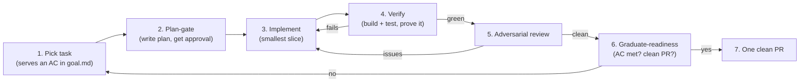

# Sandforge — Build Loop & Key Prompts

> **What this is:** the operating loop and the high-leverage prompts for building Sandforge with
> AI agents, kept anchored to [`goal.md`](goal.md) and [`design.md`](design.md). Paste these at
> the matching stage. They exist to stop the two failure modes: **drifting off-goal** and
> **declaring done without proof.**
>
> Assumption: these guard the *construction* of Sandforge (not the agent loop that runs inside a
> finished Sandforge).

---

## The loop



**Non-negotiables** (from the repo execution rules):
1. **Plan before code.** Write the plan; wait for explicit approval. "Implement the plan" ≠ approval.
2. **Verify every change.** Build/type-check/test before claiming progress.
3. **Keep context clean.** Read only what the task needs.
4. **Compound learnings.** Save corrections to memory immediately.
5. **Never break the build. Never merge to main. One clean PR per unit of work.**

---

## Prompt 1 — Kickoff / task selection

```
We are building Sandforge. Read goal.md and design.md first.
Pick the next task. Before proposing it, answer:
- Which goal.md acceptance criterion (AC-N) does this advance? If none, do not pick it.
- Which design.md section does it implement? If it contradicts design.md, stop and flag the
  contradiction instead of coding around it.
- Is it atomic and independently verifiable (one PR)? If not, split it.
State the task as: "Implements <AC-N> via <design.md §X>. Done when <testable condition>."
```

## Prompt 2 — Plan-gate (BLOCKING)

```
Write the implementation plan to a .md file before writing any code:
1. The exact files you will create/change and why.
2. How you will VERIFY it works (the command + the expected observable result) — this is the
   feedback loop; if you can't name one, the task isn't ready.
3. Which tools/parts you'll use, and a quick check they're available locally.
4. Risks / what could break (esp. the bootstrap chicken-and-egg: Forgejo health → runner token →
   act_runner online; see design.md §14).
Tell me where the plan file is and WAIT for explicit approval. Do not start coding.
```

## Prompt 3 — Scope-guard (paste whenever scope creeps)

```
Stop. Before continuing, check against goal.md:
- Are you still implementing the approved task, or did scope expand?
- Are you adding anything in the Non-Goals list (agent orchestration, k8s in the default path,
  owning a deploy target, multi-tenant)? If yes, remove it.
- Is this the SMALLEST slice that satisfies the AC? Defer everything else to a follow-up task.
Report what you cut.
```

## Prompt 4 — Implementation guardrails

```
While implementing, hold these design.md invariants — flag immediately if any is forced to break:
- Substrate is docker-compose; NO Kubernetes in the default path.
- CI = act_runner running real GitHub Actions on the HOST Docker daemon. No Docker-in-Docker.
- Two compose stacks stay distinct: control-plane (proxy+Forgejo+Postgres+runner) vs deploy-target
  (LB+App+DB, on-demand). Never conflate them.
- Branch model: work/<agent>/<slug> → staging → main. Gates at staging and main only.
- Fixed clone URL 127.0.0.1:3000. Pinned image versions, not :latest.
- Upstream creds NEVER reach the runner/agent env (goal.md AC-5).
Match the surrounding code's style. Wrap, don't reinvent (gh/glab/tea, official images).
```

## Prompt 5 — Verify-before-done (BLOCKING; no "done" without this)

```
Prove it works — do not claim done from inspection. Run the real thing:
1. Run the verification command from your plan. Paste the actual output.
2. Tie the result to the AC: which goal.md AC does this output demonstrate, and how?
3. For loop-time work, measure against the contract (AC-1/2/3) — give numbers, not "feels fast."
4. Confirm the build is green and nothing regressed.
If anything failed or was skipped, say so plainly with the output. A passing self-test that
doesn't actually exercise the AC does NOT count.
```

## Prompt 6 — Adversarial review

```
Review this change as a hostile senior engineer who has shipped local-dev tooling and seen it
fail. Do NOT just check for defects — challenge the approach:
- Does it actually serve the goal.md AC, or just look like it?
- Where does it break under real conditions: concurrent agents, large repos, bootstrap ordering,
  cache poisoning, a busy daily-driver Docker daemon, secrets reaching CI?
- Is there a simpler/smaller way that wraps an existing part instead of building new code?
Return concrete, file-referenced findings. Default to "this is wrong, prove me otherwise."
```

## Prompt 7 — Graduate-readiness (before opening the PR)

```
Gate this work before it becomes a PR:
- Are ALL acceptance criteria for the task met and individually verified? List each with its proof.
- Rebased onto fresh upstream base; e2e green against the deploy-target stack (design.md §6)?
- History squashed (default) into one clean commit; PR body carries specs, design, e2e summary,
  and the PRD success-criteria report (goal.md AC-6/AC-7)?
- Build green; no Non-Goals introduced; no main merge.
If any box is unchecked, it is NOT ready — return to the loop. Never defer a test without explicit
human approval.
```

## Prompt 8 — Compound learnings (after any correction)

```
You were just corrected (or discovered a non-obvious fact). Before moving on:
- Save it to memory now so it applies to every future session.
- Log the decision to .logs/decisions/ (JSONL), referencing the relevant design.md section.
State what you saved.
```

---

## Anti-drift one-liners (quick paste mid-flow)

- "Which goal.md AC does this serve? If none, stop."
- "Show me the command and its real output, not your conclusion."
- "Is this in design.md? If it contradicts it, flag — don't code around it."
- "Smallest slice. Defer the rest to a follow-up task."
- "Is the build green right now? Prove it."
